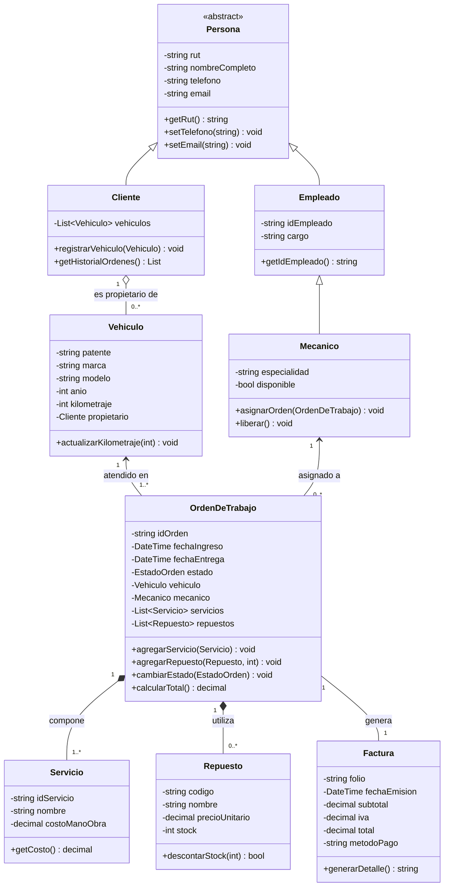

# Taller Mecánico - Modelo Orientado a Objetos Seguro

**Módulo:** Programación Orientada a Objetos Segura  
**Periodo:** Segundo Semestre, 2026  
**Institución / Contexto:** Ejercicio académico de modelado de software

---

## 1. Descripción del Proyecto

Este repositorio contiene el diseño, especificación e implementación del **modelo completo de un Taller Mecánico**. El proyecto tiene como propósito aplicar principios avanzados de la **Programación Orientada a Objetos (POO)** incorporando directrices de **desarrollo seguro** (validación rigurosa de entradas, encapsulamiento robusto, control de estados y consistencia de datos).

---

## 2. Objetivos Generales

- Modelar las entidades centrales involucradas en la operación de un taller mecánico (clientes, vehículos, personal técnico, órdenes de trabajo, repuestos y facturación).
- Garantizar la integridad de los datos mediante encapsulamiento y validación en las capas del modelo.
- Implementar relaciones adecuadas de herencia, agregación y composición según las reglas de negocio del taller.
- Aplicar estándares de seguridad en POO para evitar inconsistencias en el ciclo de vida de los servicios y reparaciones.

---

## 3. Modelo de Dominio y Entidades Principales

### 3.1. Personas y Usuarios
- **`Persona` (Clase Abstracta):** Base común con atributos protegidos y validados (`rut`, `nombreCompleto`, `telefono`, `email`).
- **`Cliente`:** Especialización de `Persona`. Mantiene la lista de vehículos asociados y el historial de atención en el taller.
- **`Empleado`:** Especialización de `Persona` con datos laborales (`idEmpleado`, `cargo`, `fechaContratacion`).
- **`Mecanico`:** Especialización de `Empleado` responsable de las reparaciones (`especialidad`, `certificaciones`, `disponible`).

### 3.2. Vehículos
- **`Vehiculo`:** Representa los automóviles ingresados al taller.
  - Atributos: `patente` (identificador único normalizado), `marca`, `modelo`, `anio`, `kilometraje`, `duenio` (asociación con `Cliente`).

### 3.3. Gestión del Trabajo y Reparaciones
- **`OrdenDeTrabajo`:** Entidad central que coordina el servicio.
  - Atributos: `idOrden`, `fechaIngreso`, `fechaEstimadaEntrega`, `estado` (`PENDIENTE`, `EN_DIAGNOSTICO`, `EN_REPARACION`, `FINALIZADO`, `ENTREGADO`), `vehiculo`, `mecanicoAsignado`, `serviciosRealizados`, `repuestosUtilizados`, `costoTotal`.
- **`Servicio`:** Tareas o prestaciones realizadas (`idServicio`, `descripcion`, `tiempoEstimado`, `precioManoObra`).
- **`Repuesto`:** Piezas o insumos utilizados (`codigoPieza`, `descripcion`, `precioUnitario`, `stockDisponible`).

### 3.4. Facturación y Cobranza
- **`Factura`:** Comprobante de pago generado al completar la orden de trabajo (`folio`, `fechaEmision`, `subtotal`, `iva`, `total`, `metodoPago`, `ordenAsociada`).

---

## 4. Diagrama de Clases (Mermaid)

---

## 5. Principios de POO Segura Aplicados

1. **Encapsulamiento estricto:** Todos los atributos críticos son privados (`private`) y se accede a ellos mediante métodos accesores controlados con validaciones (e.g., formato de RUT, patentes válidas, montos positivos).
2. **Control de estados inmutable en la Orden de Trabajo:** Las transiciones de estado (`PENDIENTE` $\rightarrow$ `EN_DIAGNOSTICO` $\rightarrow$ `EN_REPARACION` $\rightarrow$ `FINALIZADO`) impiden saltos inválidos que puedan generar cobros indebidos o entregas no autorizadas.
3. **Manejo seguro del stock:** Descuento atómico de piezas y repuestos para prevenir inconsistencias de inventario.
4. **Separación de responsabilidades (SRP):** Desacoplamiento entre la lógica de ejecución del servicio técnico y la generación tributaria/financiera en la factura.
